# LukyDog 程序官方使用指南

## 1.如何处理选择上传文件

- 表格文件数据源准备

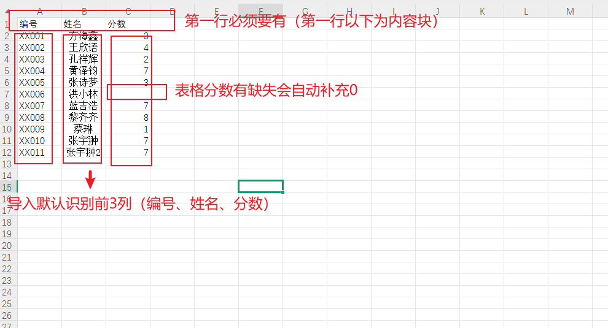

 

- 点击/拖动文件至区域内可上传

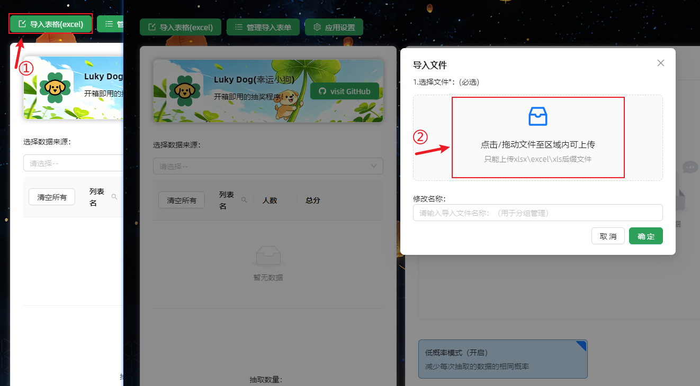

 

- 操作管控导入数据

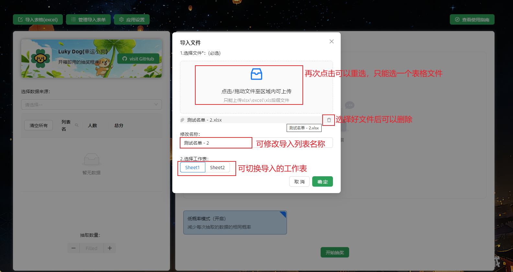

 

## 2.如何进行抽奖

- 选取到合适的表格（可多选），选择抽奖数量，选择默认/低概率模式（可选），即可点击抽奖。

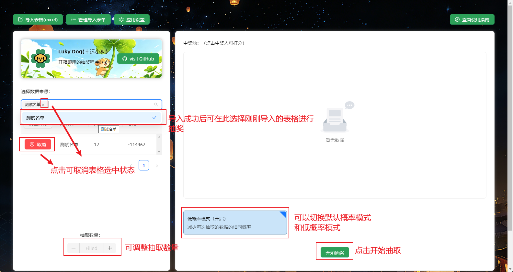

 

## 3.如何设置分数

- 点击抽奖后点击抽中元素即可设置分数，点击确定结果保存打分

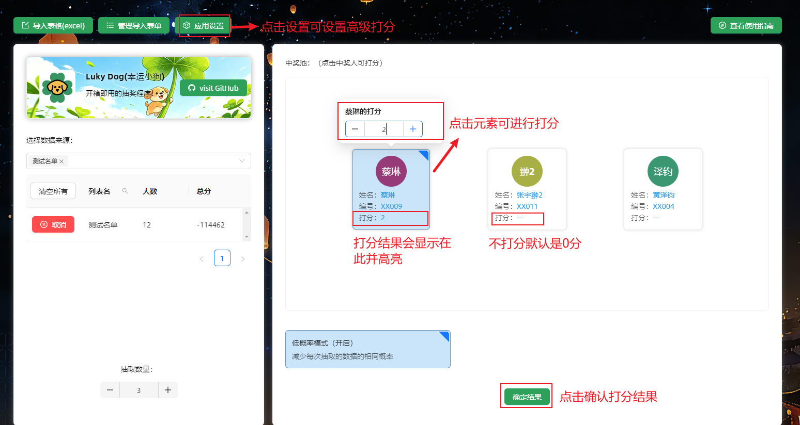

 

- 点击设置可以自己添加制定打分选项

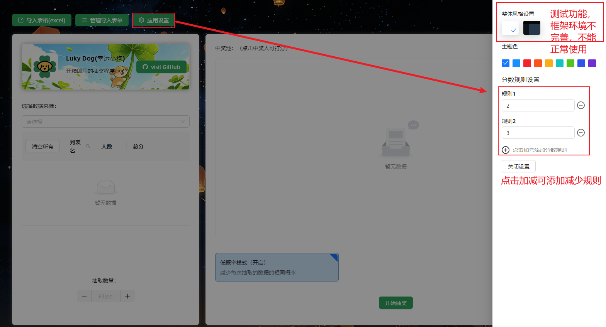

 

- 设置打分后可切换选项打分和自定义打分

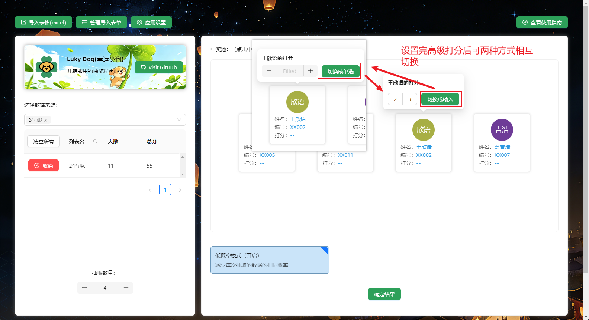

 

## 如何管理数据

- 点击表单管理可对导入数据进行增删改查操作

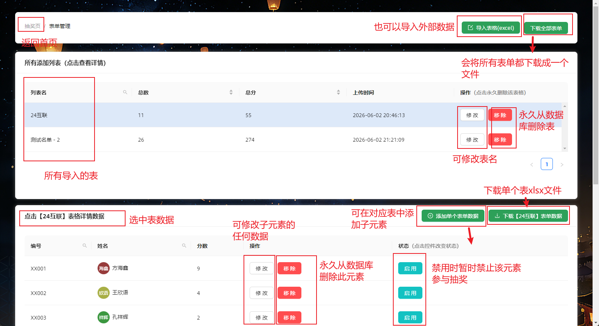

 

- 下载全部表单展示

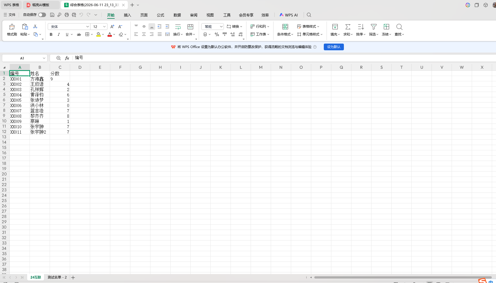

 

- 下载单个表单展示

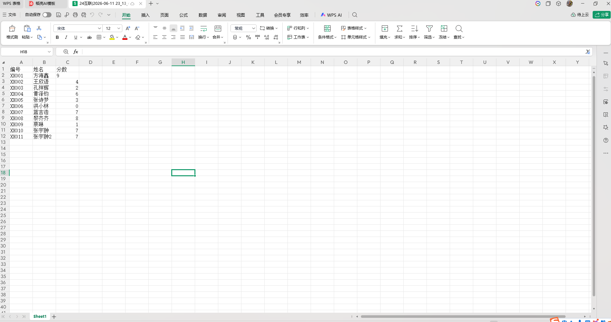

 

## 查看仓库及指南

- 若还想查看此教程可点击查看使用指南；若想查看项目源码可点击项目仓库链接。

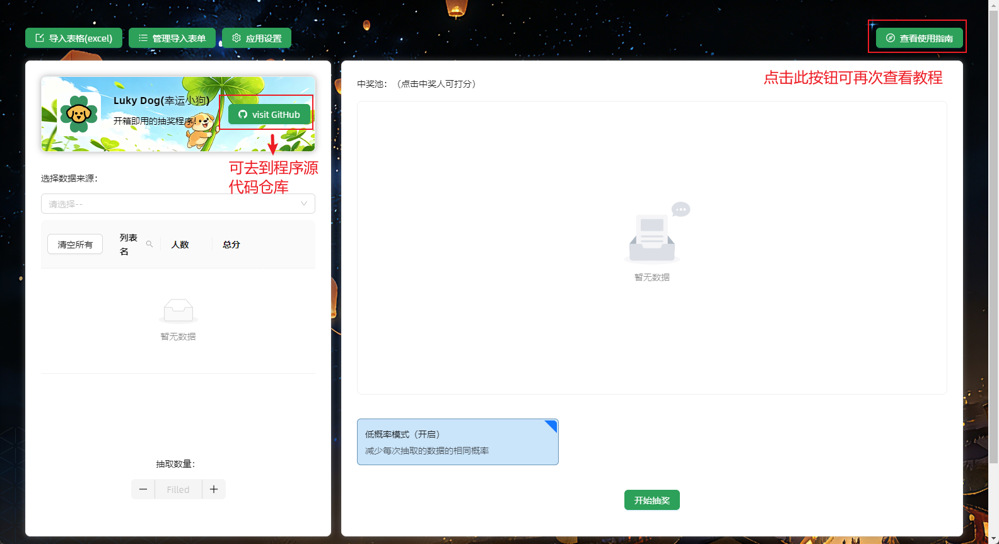
